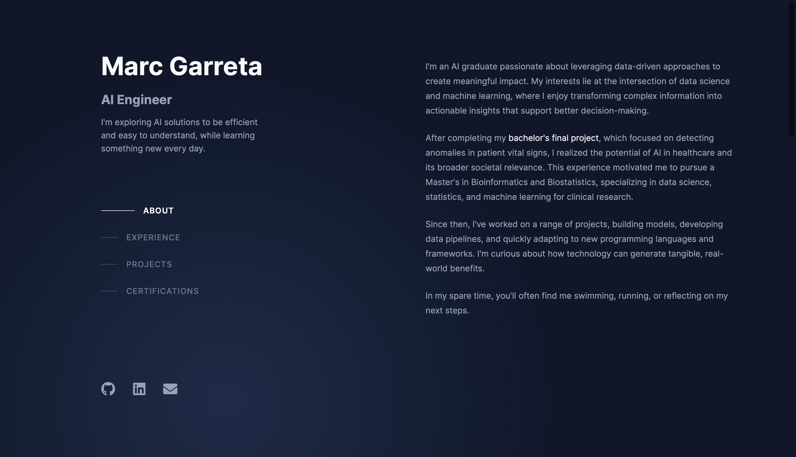

# Personal Portfolio Website 


This project is the creation of my **personal portfolio website**, available at: **[https://marcgarretabasora.vercel.app](https://marcgarretabasora.vercel.app)**  

Built with **React + Vite** and deployed on **Vercel**, this website serves both as my personal site and as a learning challenge to explore new technologies and improve my skills.

The website allows users to clearly see sections such as **About Me**, **Experience**, **Projects**, and **Certifications**. It is currently designed for **desktop screens** and is **not yet mobile-friendly**, though mobile support is planned for a future implementation.

---



---

## 🛠️ Installation & Setup

You have **two options** to use this project: run it locally or deploy it through Vercel.

### ▶️ Option 1 — Run Locally

```bash
# Fork or clone the repository
git clone https://github.com/marcgarreta/marcgarreta-portfolio

# Navigate to the project folder
cd marcgarreta-portfolio

# Install dependencies
npm install

# Start the development server
npm run dev
```
### ▶️ Option 2 — Deploy via Vercel

```bash
1. Fork or clone the repository
git clone https://github.com/marcgarreta/marcgarreta-portfolio

2. Go to Vercel https://vercel.com

3. Click New Project -> Import Repository

4 Select your fork or the cloned repository

5. Ensure the Framework Preset is Vite

6. Click Deploy
```

---

## 🙌 Credits

- **Marc Garreta** – Coded and implemented the website  
- **Brittany Chiang** – Design inspiration from [https://brittanychiang.com](https://brittanychiang.com)

---

## 📄 License

This project is licensed under the **MIT License**.  
See the [LICENSE](./LICENSE) file for more details.


